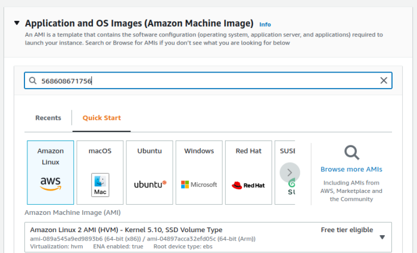
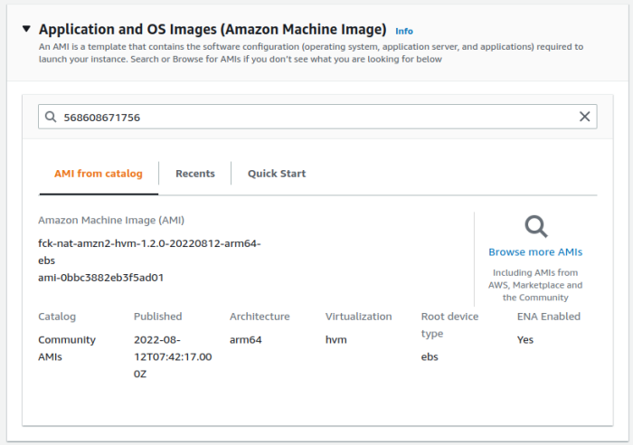
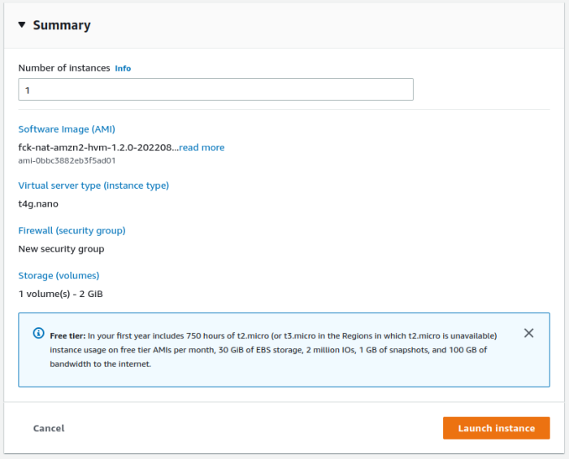
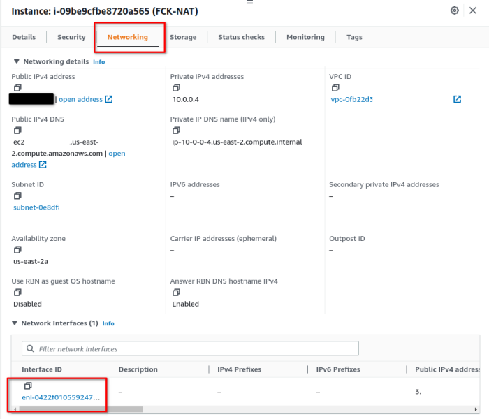
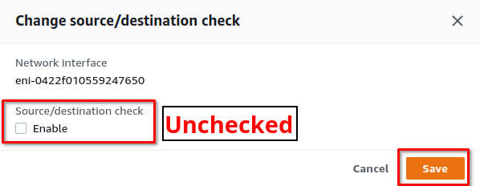
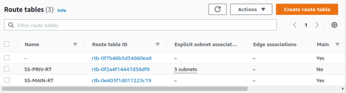
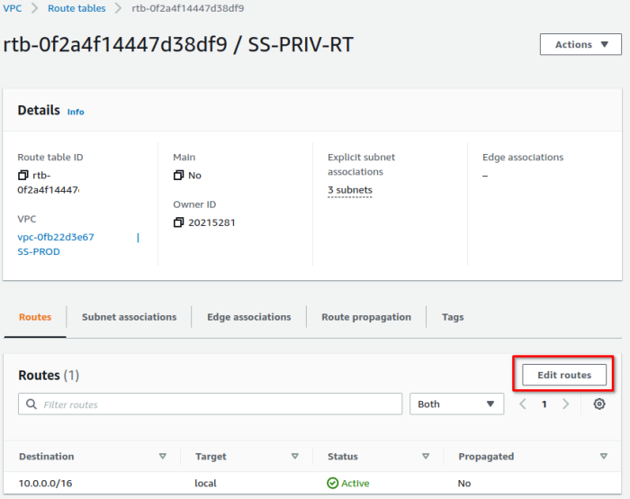

# Deploying fck-nat

The most well-supported way to deploy fck-nat with all of its features available out of the box is via CDK. If you're
using another Infrastructure-as-code provider, you can still deploy a basic NAT instance with fck-nat, but it is more
intensive to support some of fck-nat's additional features.

## CDK

fck-nat provides an official CDK module which supports all of fck-nat's features (namely high-availability mode)
out-of-the-box. The CDK module is currently available both in Typescript and Python. You can find detailed
documentation on [Construct Hub](https://constructs.dev/packages/cdk-fck-nat/v/1.0.0). Here's an example use of the
CDK construct in Typescript:

``` ts
const natGatewayProvider = new FckNatInstanceProvider({
    instanceType: InstanceType.of(InstanceClass.T4G, InstanceSize.NANO),
});
const vpc = new Vpc(this, 'vpc', {
    natGatewayProvider,
});
natGatewayProvider.securityGroup.addIngressRule(Peer.ipv4(vpc.vpcCidrBlock), Port.allTraffic());
```

That's it! This will deploy your VPC using fck-nat as your NAT provider in high availability mode. This includes all
necessary routing configurations and deploys fck-nat in an Autoscaling group to ensure that a new instance is brought
up automatically in case the NAT instance is terminated.

You can also deploy fck-nat in non-HA mode using CDK's built-in `NatInstanceProvider` like so:

``` ts
const natGatewayProvider = new NatInstanceProvider({
    instanceType: InstanceType.of(InstanceClass.T4G, InstanceSize.NANO),
    machineImage: new LookupMachineImage({
        name: 'fck-nat-al2023-*-arm64-ebs',
        owners: ['568608671756'],
    })
})
const vpc = new Vpc(this, 'vpc', {
    natGatewayProvider,
});
natGatewayProvider.securityGroup.addIngressRule(Peer.ipv4(vpc.vpcCidrBlock), Port.allTraffic());
```

[Read more about the `NatInstanceProvider` construct](https://docs.aws.amazon.com/cdk/api/latest/docs/@aws-cdk_aws-ec2.NatInstanceProvider.html)

## Terraform

Doriann Corlouër ([RaJiska](https://github.com/RaJiska/)) maintains the official fck-nat Terraform module over at
[terraform-aws-fck-nat](https://github.com/RaJiska/terraform-aws-fck-nat). Below is a sample of how to use that module
and full documentation can be found on the
[Terraform Registry](https://registry.terraform.io/modules/RaJiska/fck-nat/aws/latest)

```hcl
module "fck-nat" {
  source = "RaJiska/fck-nat/aws"

  name                 = "my-fck-nat"
  vpc_id               = "vpc-abc1234"
  subnet_id            = "subnet-abc1234"
  # ha_mode              = true                 # Enables high-availability mode
  # eip_allocation_ids   = ["eipalloc-abc1234"] # Allocation ID of an existing EIP
  # use_cloudwatch_agent = true                 # Enables Cloudwatch agent and have metrics reported

  update_route_tables = true
  route_tables_ids = {
    "your-rtb-name-A" = "rtb-abc1234Foo"
    "your-rtb-name-B" = "rtb-abc1234Bar"
  }
}
```

It is also possible to configure fck-nat with out-of-the-box Terraform modules, but you may not be able to leverage all
of fck-nat's features.

```hcl
data "aws_ami" "fck_nat" {
  filter {
    name   = "name"
    values = ["fck-nat-al2023-*"]
  }

  filter {
    name   = "architecture"
    values = ["arm64"]
  }

  owners      = ["568608671756"]
  most_recent = true
}

resource "aws_network_interface" "fck-nat-if" {
  subnet_id       = aws_subnet.subnet_public.id
  security_groups = [aws_default_security_group.default_security_group.id]

  source_dest_check = false
}

resource "aws_instance" "fck-nat" {                                                   
  ami           = data.aws_ami.fck_nat.id
  instance_type = "t4g.nano"

  network_interface {
    network_interface_id = aws_network_interface.fck-nat-if.id
    device_index         = 0
  }                                                                              
}
```

## CloudFormation

!!! note
    If you'd be interested in seeing fck-nat published on the CloudFormation registry,
    [give this issue a +1](https://github.com/AndrewGuenther/cdk-fck-nat/issues/295)

For brevity, this document assumes you already have a VPC with public and private subnets defined in your
CloudFormation template. This example template provisions the minimum resources required to connect fck-nat in your
VPC. This is a good option for those that have an existing VPC and NAT Gateway and are looking to switch over. 

1. A security group allowing ingress traffic from within the VPC and egress out to the internet
2. A auto scaling group that creates an EC2 instance using the fck-nat AMI
3. A route in the private subnet route table directing traffic to the fck-nat instance.

This snippet assumes the following resources are already defined:

1. `VPC`: An `AWS::EC2::VPC` resource.
2. `PublicSubnet`: An `AWS::EC2::Subnet` which has an `AWS::EC2::InternetGateway` attached.
3. `PrivateSubnetRouteTable`: An `AWS::EC2::RouteTable` with an `AWS::EC2::SubnetRouteTableAssociation` to a `AWS::EC2::Subnet`

Steps to deploy:

1. Paste your VPC ID, public subnet ID, VPC CIDR block into the parameters. Set the [FckNatAMIParameter](index.md#getting-a-fck-nat-ami) based on the region fck-nat is deployed to.
2. Ensure that your public subnet has `Enable auto-assign public IPv4 address` turned on. This can be found in the Console at `VPC > Subnets > Edit subnet settings > Auto-assign IP settings`.
3. Deploy with CloudFormation `aws cloudformation deploy --force-upload --capabilities CAPABILITY_IAM --template-file template.yml --stack-name FckNat`
4. Add the default route to your route table on the subnet. It is best to do this manually so you can do a seamless cut over from your existing NAT gateway. Go to `VPC > Route Tables > Private route table > Routes > Edit Routes` Add a 0.0.0.0/0 route pointing to the network interface.

``` yaml
Parameters:
  VpcIdParameter:
    Type: AWS::EC2::VPC::Id
  SubnetIdParameter:
    Type: AWS::EC2::Subnet::Id
  CIDRParameter:
    Type: String
    Default: "10.0.0.0/16"
  FckNatAMIParameter:
    Type: AWS::EC2::Image::Id

Resources:
  FckNatInterface:
    Type: AWS::EC2::NetworkInterface
    Properties:
      Description: FckNat Gateway Interface
      SubnetId: !Ref SubnetIdParameter
      GroupSet:
        - !GetAtt [FckNatSecurityGroup, GroupId]
      SourceDestCheck: false
  FckNatAsgInstanceProfile:
    Type: AWS::IAM::InstanceProfile
    Properties:
      Roles:
        - !Ref FckNatRole
  FckNatLaunchTemplate:
    Type: AWS::EC2::LaunchTemplate
    DependsOn: FckNatRole
    Properties:
      LaunchTemplateName: FckNatLaunchTemplate
      LaunchTemplateData:
        ImageId: !Ref FckNatAMIParameter
        InstanceType: t4g.nano
        IamInstanceProfile:
          Name: !Ref FckNatAsgInstanceProfile
        SecurityGroupIds:
          - !GetAtt [FckNatSecurityGroup, GroupId]
        UserData:
          Fn::Base64: !Sub |
            #!/bin/bash
            echo "eni_id=${FckNatInterface}" >> /etc/fck-nat.conf
            service fck-nat restart
  FckNatAsg:
    Type: AWS::AutoScaling::AutoScalingGroup
    Properties:
      MaxSize: "1"
      MinSize: "1"
      DesiredCapacity: "1"
      LaunchTemplate:
        LaunchTemplateId: !Ref FckNatLaunchTemplate
        Version: !GetAtt FckNatLaunchTemplate.LatestVersionNumber
      VPCZoneIdentifier:
        - !Ref SubnetIdParameter
      Tags:
        - Key: Name
          Value: fck-nat
          PropagateAtLaunch: true
    UpdatePolicy:
      AutoScalingScheduledAction:
        IgnoreUnmodifiedGroupSizeProperties: true
  FckNatSecurityGroup:
    Type: AWS::EC2::SecurityGroup
    Properties:
      GroupDescription: Security Group for FckNat
      SecurityGroupIngress:
        - CidrIp: !Ref CIDRParameter
          IpProtocol: "-1"
      SecurityGroupEgress:
        - CidrIp: 0.0.0.0/0
          Description: Allow all outbound traffic by default
          IpProtocol: "-1"
      VpcId: !Ref VpcIdParameter
  FckNatRole:
    Type: AWS::IAM::Role
    Properties:
      AssumeRolePolicyDocument:
        Statement:
          - Action: sts:AssumeRole
            Effect: Allow
            Principal:
              Service: ec2.amazonaws.com
        Version: "2012-10-17"
      Policies:
        - PolicyName: AttachNatEniPolicy
          PolicyDocument:
            Statement:
              - Action:
                  - ec2:AttachNetworkInterface
                  - ec2:ModifyNetworkInterfaceAttribute
                Effect: Allow
                Resource: "*"
            Version: "2012-10-17"
        - PolicyName: AssociateNatAddressPolicy
          PolicyDocument:
            Statement:
              - Action:
                  - ec2:AssociateAddress
                  - ec2:DisassociateAddress
                Effect: Allow
                Resource: "*"
            Version: "2012-10-17"
```

## Manual - Web Console
The following instructions can be used to deploy the fck-nat AMI manually.  
**Summary: ** 
1. Launch fck-nat AMI
2. Modify ENI to disable source/dest check
3. Modify the private route table, default route to fck-nat target
4. Validate

**NOTE:** The following example uses fck-nat AMI version 1.2.0 for arm64 on t4g.nano.

### EC2 Instance Launch
1. Visit the EC2 service in your preferred region: [EC2 Link](https://us-east-2.console.aws.amazon.com/ec2/)
2. Click Launch Instances  
   
3. Give the instance a name  
   
4. Search for AMIs owned by "568608671756"
   
5. Select the ARM64 1.2.0 fck-nat AMI  
     
     
6. Select Instance Type t4g.nano  
     
7. Modify Network Settings  
   - Select VPC  
   - Place in public subnet, ensure Public IP is assigned  
   - Attached Security group that permits  
       inbound: entire VPC CIDR inbound, all traffic  
       outbound: 0.0.0.0/0, all traffic  
     
8. Leave Storage at 2GB  
     
9. Review and launch  
     

**Wait for Launch**

### Modify EC2 Network Interface
We must modify the ENI attached to the newly launched instance to disable source/destination checks, this allows us to route _through_ (actually hairpinning) the instance.
1. Click on the ENI of the instance  
     
2. Select ENI, Click Actions -> Change source/dest. check  
     
3. Disable Source/Dest check and Save  
     
 
### Modify VPC Routing Table
The VPC routing table associated with your private subnets must be modified to route traffic matching the default route to the new fck-nat instance.  
1.  Open the VPC Service, Route Tables  
     
2. Open the private route table, edit routes  
     
3. Add a default route, target: fck-nat instance  
     

### Validate
Log into an instance in a private subnet and validate the external IP is the public IP assigned to your fck-nat instance.  

  


